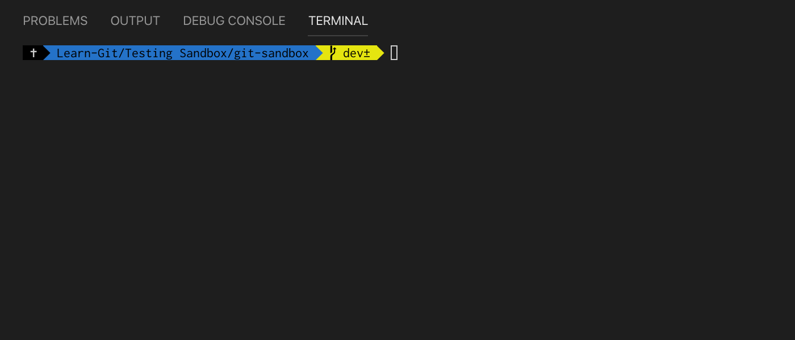
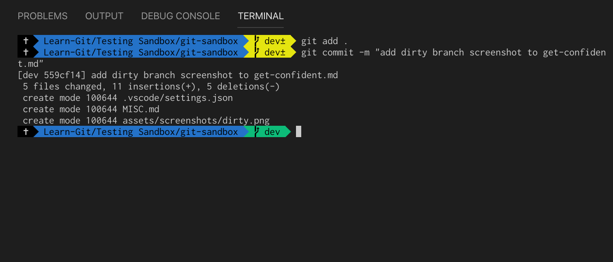

# **Get Confident with the Command Line**

If you want to manage your Git workflow efficiently and quickly, something that will really help you out will be to build up your confidence in the Command Line. It can be a daunting place if you're a beginner, but hopefully this chapter will get you up to speed on the tools you have available to you and how best you can use them.

## **Custom ZSH**
If you want to become effective in manipulating your git branches from the command line, then ZSH is something that can really help you here. With ZSH you can customise your command line environment so that useful information such as current location in the directory, or current branch, is readily available. This will give you a huge boost in command line confidence. Some resources on how to get started can be found here:

[Wes Bos'](https://github.com/wesbos) [Command Line Power User](https://commandlinepoweruser.com/)

[Oh My Zsh!](https://ohmyz.sh)

You can use custome ZSH themes like the one above to keep track of which branch you're on and whether or not it's 'dirty'. This means that you can bounce around from branch to branch knowing that you're not at risk of losing any changes you've made. 

If you see that you're on a dirty branch, then it's probably best for you to stage and commit your changes before moving around.

## **Commit, commit, commit!**
Generally, if you feel like it's a good time to commit, then you should follow that instinct. Commits in git are just like save points in video games - you will store all of the progress you've made so if you get lost or your code gets tangled up, you will always have your save point to revert back to at any time.

>💡It's always better to make a commit you don't need that it is to need to have made a commit when you haven't done so.

If your commit is messy or you would rather to have arranged it differently, then you can always amend your commits at a later stage.

## **Git Stash**
As your project progresses, you can work on blocks of code or files that might become messy or a task you're trying to accomplish might be in an incomplete state that you don't want to commit yet. If this is the case and you also need to change branches then `git stash` will take your changes on your tracked files and put them on a shelf for you to come back to any any time. This means that you can store your changes away and switch to another branch to continue with working on something else.

> ⚠️    **`git stash` will ignore untracked files by default.**             
> Use `git status` before you stash your changes to check for any untracked files. If you do have untracked files then you can use `git stash -u` which will also stash untracked (`-u`) files.

You can reapply previously stashed changes using `git stash pop`.

### Creating a branch from stash
Sometimes you might use `git stash` and continue to work on that branch for a while, making additional changes. When you then try to reapply your stashed work, you'll get a merge conflict that you'll need to resolve. An easier way to test your stashed changes will be to run `git stash branch` - this will create a new branch, checkout the last commit made before stashing this work, apply the stashed changes and drop the stash if the changes are applied successfully. This allows you to work on your stashed changes on a new branch without running into any merge conflicts with other branches.

## **Git Reflog** 
This is a log of all of the references made in the history of your repo.