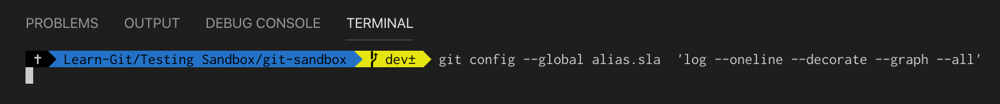

# **Managing History**

One of the most powerful features of Git is that it allows you to traverse the history of your project. With this in mind, one of the most valuable things that you can learn about Git is how to effectively travel through your projects timeline to find a specific change at a specific point in time. 

In this section we'll cover what you have available in Git to help you do just that.

## **Enhance your Git log**
You will be familiar with `git log` as the command that you run to give you a breakdown of your past commits leading up to where you are now. This contains information such as the Author, date and time, SHA of each commit. 

### **`git log --oneline`**
Sometimes you might not want such a verbose description of each commit, you might only want the basic info of each commit to provide you with a quick overview. This is where you'd use `git log --oneline`. This will slim down the output of your log right down to an abbreviated SHA along with the first line of your commit message.
>💡The first line of your commit message is known as the 'commit summary'. It's best to keep this to no longer than around 40 - 50 characters to keep this terse and concise with the information required.

### **`git log --oneline --decorate`**
Adding `--decorate` will overlay information about the branches to the git history shown in the log. The three colours you'll see here are blue, for HEAD (what you currently have checked out), green for your local branches (above you can see that HEAD is pointing at a local branch called dev), and red for your remote branches.

### **`git log --oneline --decorate --graph --all`**

This will show you essentially your complete history. You can see all branches that may have diverged off and if they not have or haven't merged back to your current branch.
 
### **"But that's too much to type..."**
Luckily, you don't need to type all of that when you want to see that view of your history. You can create an alias for this by running `git config --global alias.[alias name]` before your command in quotations to create an alias, such as below.

So now if I run my alias (I've chosen sla for 'short log all', but you can make this anything you want) then I run the whole command I've saved. 

## Choose what your log shows you

## Search for a commit

## Search for a change in code

## See the log for a specific file within your repo

## Git Blame

## Git Show

## Summary